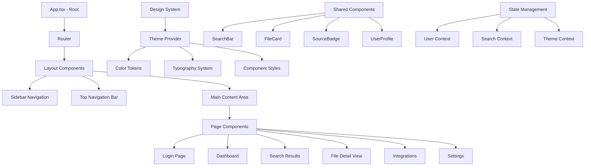
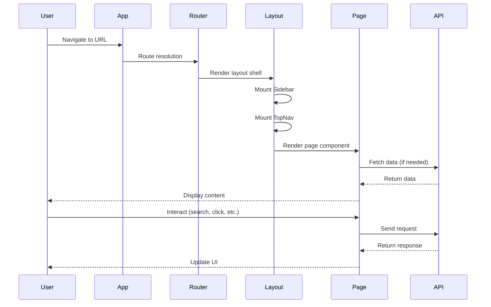

# Design Document: Frontend Redesign

## Overview

This feature implements a complete frontend redesign of the ZenXplor universal search application to match the provided wireframes exactly. The redesign transforms the current React + TypeScript frontend into a modern, dark-themed interface with a sophisticated design system based on Material Design 3 principles. The new design features a fixed sidebar navigation, responsive layouts, and a cohesive visual language across all views including login, dashboard, search results, file details, integrations, and settings pages.

The redesign maintains the existing backend API integration while completely overhauling the UI components, styling system, and user experience patterns. All views will be responsive and optimized for desktop-first usage with mobile considerations.

## Architecture



## Main Algorithm/Workflow



## Components and Interfaces

### Component 1: Sidebar Navigation

**Purpose**: Provides persistent navigation across all authenticated views with active state indication

**Interface**:
```typescript
interface SidebarProps {
  activePage: string;
  onNavigate: (page: string) => void;
  user?: User;
}

interface NavItem {
  id: string;
  label: string;
  icon: string;
  path: string;
}
```

**Responsibilities**:
- Display navigation menu with icons and labels
- Highlight active navigation item with border and background
- Show user profile section at bottom
- Provide "Connect Source" CTA button
- Handle navigation clicks and route changes

### Component 2: Top Navigation Bar

**Purpose**: Provides search functionality and user actions across all pages

**Interface**:
```typescript
interface TopNavProps {
  searchQuery?: string;
  onSearch?: (query: string) => void;
  showSearch?: boolean;
  user?: User;
}
```

**Responsibilities**:
- Display search input with icon
- Show notification and apps icons
- Display user avatar with dropdown
- Handle search input changes
- Maintain sticky positioning

### Component 3: Search Results Grid

**Purpose**: Displays search results in a responsive grid or list layout

**Interface**:
```typescript
interface SearchResultsProps {
  results: SearchResult[];
  onResultClick: (result: SearchResult) => void;
  layout: 'grid' | 'list' | 'split';
  filters: SearchFilters;
}

interface SearchResult {
  id: string;
  title: string;
  path: string;
  source: 'drive' | 'local' | 'dropbox' | 'gmail' | 'photos';
  fileType: string;
  size: string;
  modifiedDate: string;
  thumbnail?: string;
}
```

**Responsibilities**:
- Render search results in specified layout
- Apply filters to results
- Handle result selection
- Show source badges and file type indicators
- Display metadata (size, date, path)

### Component 4: File Detail Panel

**Purpose**: Shows detailed information about a selected file in a side panel or overlay

**Interface**:
```typescript
interface FileDetailProps {
  file: SearchResult;
  onClose: () => void;
  onOpen: () => void;
  onDownload: () => void;
  onStar: () => void;
}
```

**Responsibilities**:
- Display file preview/thumbnail
- Show file metadata (size, type, path, dates)
- Provide action buttons (open, download, star, share)
- Show access permissions and collaborators
- Handle panel close/dismiss

### Component 5: Integration Card

**Purpose**: Displays connection status and actions for each integration source

**Interface**:
```typescript
interface IntegrationCardProps {
  source: IntegrationSource;
  onConnect: () => void;
  onManage: () => void;
  onDisconnect: () => void;
}

interface IntegrationSource {
  id: string;
  name: string;
  icon: string;
  status: 'connected' | 'syncing' | 'inactive' | 'error';
  lastSync?: string;
  fileCount?: number;
  metadata?: Record<string, any>;
}
```

**Responsibilities**:
- Show integration icon and name
- Display connection status badge
- Show sync information
- Provide connect/manage/disconnect actions
- Handle integration state changes

### Component 6: Settings Form

**Purpose**: Provides user settings management with form controls

**Interface**:
```typescript
interface SettingsFormProps {
  section: 'profile' | 'account' | 'search' | 'notifications' | 'appearance' | 'privacy';
  settings: UserSettings;
  onSave: (settings: Partial<UserSettings>) => void;
}

interface UserSettings {
  profile: {
    firstName: string;
    lastName: string;
    email: string;
    avatar?: string;
  };
  appearance: {
    theme: 'light' | 'dark' | 'system';
    accentColor: string;
    compactView: boolean;
    showFileExtensions: boolean;
  };
  search: {
    defaultSource: string;
    resultsPerPage: number;
    fuzzySearch: boolean;
  };
}
```

**Responsibilities**:
- Render form fields for selected section
- Validate input values
- Handle form submission
- Show save/cancel actions
- Display success/error feedback

## Data Models

### Model 1: User

```typescript
interface User {
  id: string;
  username: string;
  email: string;
  profile_picture?: string;
  firstName?: string;
  lastName?: string;
  createdAt: string;
  settings: UserSettings;
}
```

**Validation Rules**:
- `email` must be valid email format
- `username` must be unique and 3-50 characters
- `profile_picture` must be valid URL or base64 image

### Model 2: SearchResult

```typescript
interface SearchResult {
  id: string;
  title: string;
  path: string;
  source: 'drive' | 'local' | 'dropbox' | 'gmail' | 'photos';
  fileType: string;
  size: string;
  sizeBytes: number;
  modifiedDate: string;
  createdDate: string;
  owner?: string;
  thumbnail?: string;
  isStarred: boolean;
  isFavorite: boolean;
  tags?: string[];
  metadata?: Record<string, any>;
}
```

**Validation Rules**:
- `id` must be unique
- `source` must be one of allowed values
- `sizeBytes` must be non-negative integer
- `modifiedDate` and `createdDate` must be valid ISO date strings

### Model 3: Theme Configuration

```typescript
interface ThemeConfig {
  colors: {
    primary: string;
    'primary-container': string;
    'on-primary': string;
    'on-primary-container': string;
    secondary: string;
    'on-secondary': string;
    tertiary: string;
    'on-tertiary': string;
    error: string;
    'on-error': string;
    background: string;
    'on-background': string;
    surface: string;
    'on-surface': string;
    'surface-variant': string;
    'on-surface-variant': string;
    outline: string;
    'outline-variant': string;
    // ... additional Material Design 3 color tokens
  };
  typography: {
    headline: string;
    body: string;
    label: string;
    mono: string;
  };
  borderRadius: {
    default: string;
    lg: string;
    xl: string;
    full: string;
  };
}
```

**Validation Rules**:
- All color values must be valid hex, rgb, or hsl format
- Font family names must be valid CSS font-family values
- Border radius values must be valid CSS length units

## Algorithmic Pseudocode

### Main Application Initialization

```typescript
ALGORITHM initializeApplication()
INPUT: None
OUTPUT: Rendered application

BEGIN
  ASSERT environment variables are loaded
  
  // Step 1: Initialize theme
  theme ← loadThemeFromLocalStorage() OR getDefaultTheme()
  ASSERT theme.colors is defined AND theme.typography is defined
  
  // Step 2: Check authentication
  authState ← await checkAuthentication()
  IF authState.authenticated THEN
    user ← authState.user
    ASSERT user.id is defined
  ELSE
    user ← null
  END IF
  
  // Step 3: Initialize router
  router ← createBrowserRouter(routes)
  ASSERT router is defined
  
  // Step 4: Render application
  RENDER(
    <ThemeProvider theme={theme}>
      <AuthContext.Provider value={{user, setUser}}>
        <RouterProvider router={router} />
      </AuthContext.Provider>
    </ThemeProvider>
  )
  
  ASSERT application is mounted to DOM
END
```

**Preconditions:**
- DOM is ready
- Environment variables (VITE_BACKEND_URL, VITE_CLERK_PUBLISHABLE_KEY) are set
- React and dependencies are loaded

**Postconditions:**
- Application is rendered to DOM
- Theme is applied
- Authentication state is initialized
- Router is active

**Loop Invariants:** N/A

### Search Results Filtering

```typescript
ALGORITHM filterSearchResults(results, filters)
INPUT: results (array of SearchResult), filters (SearchFilters)
OUTPUT: filteredResults (array of SearchResult)

BEGIN
  ASSERT results is array
  ASSERT filters is defined
  
  filteredResults ← []
  
  FOR each result IN results DO
    ASSERT result.id is defined
    
    // Check source filter
    IF filters.sources.length > 0 AND NOT filters.sources.includes(result.source) THEN
      CONTINUE
    END IF
    
    // Check file type filter
    IF filters.fileTypes.length > 0 AND NOT filters.fileTypes.includes(result.fileType) THEN
      CONTINUE
    END IF
    
    // Check date range filter
    IF filters.dateRange is defined THEN
      resultDate ← parseDate(result.modifiedDate)
      IF resultDate < filters.dateRange.start OR resultDate > filters.dateRange.end THEN
        CONTINUE
      END IF
    END IF
    
    // Check search query
    IF filters.query is defined AND filters.query ≠ "" THEN
      IF NOT matchesQuery(result, filters.query, filters.fuzzySearch) THEN
        CONTINUE
      END IF
    END IF
    
    // All filters passed
    filteredResults.add(result)
  END FOR
  
  ASSERT filteredResults.length ≤ results.length
  
  RETURN filteredResults
END
```

**Preconditions:**
- `results` is a valid array of SearchResult objects
- `filters` is a valid SearchFilters object
- All result objects have required fields (id, source, fileType, modifiedDate)

**Postconditions:**
- Returns array of SearchResult objects that match all filter criteria
- Original `results` array is not modified
- Returned array length is less than or equal to input array length

**Loop Invariants:**
- All previously processed results that passed filters are in `filteredResults`
- No result is added to `filteredResults` more than once
- Original `results` array remains unchanged

### Theme Application

```typescript
ALGORITHM applyTheme(theme)
INPUT: theme (ThemeConfig)
OUTPUT: None (side effect: updates DOM)

BEGIN
  ASSERT theme is defined
  ASSERT theme.colors is object
  
  root ← document.documentElement
  ASSERT root is defined
  
  // Apply color tokens as CSS variables
  FOR each (colorName, colorValue) IN theme.colors DO
    ASSERT colorValue is valid color string
    root.style.setProperty(`--color-${colorName}`, colorValue)
  END FOR
  
  // Apply typography
  FOR each (typeName, fontFamily) IN theme.typography DO
    ASSERT fontFamily is string
    root.style.setProperty(`--font-${typeName}`, fontFamily)
  END FOR
  
  // Apply border radius
  FOR each (sizeName, radiusValue) IN theme.borderRadius DO
    ASSERT radiusValue is valid CSS length
    root.style.setProperty(`--radius-${sizeName}`, radiusValue)
  END FOR
  
  // Add dark mode class if applicable
  IF theme.mode === 'dark' THEN
    root.classList.add('dark')
  ELSE
    root.classList.remove('dark')
  END IF
  
  // Save to localStorage
  localStorage.setItem('theme', JSON.stringify(theme))
END
```

**Preconditions:**
- `theme` is a valid ThemeConfig object
- All color values are valid CSS color strings
- All font families are valid CSS font-family values
- document.documentElement is accessible

**Postconditions:**
- CSS custom properties are set on root element
- Dark mode class is applied/removed based on theme mode
- Theme is persisted to localStorage
- Visual appearance of application reflects theme

**Loop Invariants:**
- All previously processed theme properties are applied to DOM
- No CSS property is set more than once per loop iteration

## Key Functions with Formal Specifications

### Function 1: useSearchResults()

```typescript
function useSearchResults(query: string, filters: SearchFilters): {
  results: SearchResult[];
  loading: boolean;
  error: Error | null;
  refetch: () => void;
}
```

**Preconditions:**
- `query` is a string (may be empty)
- `filters` is a valid SearchFilters object
- Backend API is accessible

**Postconditions:**
- Returns object with `results`, `loading`, `error`, and `refetch` properties
- If successful: `results` contains array of SearchResult objects, `loading` is false, `error` is null
- If loading: `loading` is true, `results` may be stale or empty
- If error: `error` contains Error object, `loading` is false
- `refetch` function triggers new API call when invoked

**Loop Invariants:** N/A (hook manages internal state)

### Function 2: handleFileOpen()

```typescript
function handleFileOpen(file: SearchResult): Promise<void>
```

**Preconditions:**
- `file` is a valid SearchResult object
- `file.id` is defined and non-empty
- `file.source` is one of allowed source types
- User has permission to access the file

**Postconditions:**
- If successful: File is opened in appropriate application or browser tab
- If error: Error is logged and user is notified
- No mutations to `file` parameter
- Navigation may occur (external link)

**Loop Invariants:** N/A

### Function 3: validateSearchFilters()

```typescript
function validateSearchFilters(filters: Partial<SearchFilters>): boolean
```

**Preconditions:**
- `filters` is an object (may be partial)

**Postconditions:**
- Returns boolean indicating validity
- `true` if and only if all provided filter values are valid
- No mutations to `filters` parameter
- Validation errors are logged to console

**Loop Invariants:**
- For validation loops: All previously checked filter properties are valid when loop continues

### Function 4: syncIntegrationSource()

```typescript
function syncIntegrationSource(sourceId: string): Promise<SyncResult>
```

**Preconditions:**
- `sourceId` is a valid integration source identifier
- Integration source exists and is connected
- User is authenticated
- Backend API is accessible

**Postconditions:**
- Returns Promise that resolves to SyncResult object
- If successful: `SyncResult.success` is true, `SyncResult.fileCount` indicates files synced
- If error: `SyncResult.success` is false, `SyncResult.error` contains error message
- Integration source status is updated in state
- UI reflects sync progress and completion

**Loop Invariants:** N/A (async operation)

## Example Usage

```typescript
// Example 1: Basic application setup
import { App } from './App';
import { createRoot } from 'react-dom/client';

const root = createRoot(document.getElementById('root')!);
root.render(<App />);

// Example 2: Using search results hook
function SearchPage() {
  const [query, setQuery] = useState('');
  const [filters, setFilters] = useState<SearchFilters>({
    sources: [],
    fileTypes: [],
    fuzzySearch: true
  });
  
  const { results, loading, error, refetch } = useSearchResults(query, filters);
  
  if (loading) return <LoadingSpinner />;
  if (error) return <ErrorMessage error={error} />;
  
  return (
    <SearchResults 
      results={results} 
      onResultClick={handleResultClick}
      layout="grid"
      filters={filters}
    />
  );
}

// Example 3: Theme application
function ThemeToggle() {
  const { theme, setTheme } = useTheme();
  
  const toggleDarkMode = () => {
    const newTheme = {
      ...theme,
      mode: theme.mode === 'dark' ? 'light' : 'dark'
    };
    setTheme(newTheme);
    applyTheme(newTheme);
  };
  
  return (
    <button onClick={toggleDarkMode}>
      {theme.mode === 'dark' ? 'Light Mode' : 'Dark Mode'}
    </button>
  );
}

// Example 4: File detail panel
function FileDetailView({ fileId }: { fileId: string }) {
  const file = useFile(fileId);
  const [isOpen, setIsOpen] = useState(true);
  
  const handleOpen = async () => {
    await handleFileOpen(file);
  };
  
  const handleDownload = async () => {
    await downloadFile(file);
  };
  
  return (
    <FileDetailPanel
      file={file}
      onClose={() => setIsOpen(false)}
      onOpen={handleOpen}
      onDownload={handleDownload}
      onStar={() => toggleStar(file.id)}
    />
  );
}

// Example 5: Integration management
function IntegrationsPage() {
  const { sources, connectSource, disconnectSource } = useIntegrations();
  
  return (
    <div className="integrations-grid">
      {sources.map(source => (
        <IntegrationCard
          key={source.id}
          source={source}
          onConnect={() => connectSource(source.id)}
          onManage={() => navigateToManage(source.id)}
          onDisconnect={() => disconnectSource(source.id)}
        />
      ))}
    </div>
  );
}
```

## Correctness Properties

### Universal Quantification Statements

1. **Theme Consistency**: ∀ component ∈ Application, component uses theme tokens from ThemeProvider
2. **Navigation State**: ∀ page ∈ AuthenticatedPages, exactly one navigation item is active
3. **Search Results**: ∀ result ∈ SearchResults, result matches all active filters
4. **File Access**: ∀ file ∈ DisplayedFiles, user has permission to view file
5. **Integration Status**: ∀ source ∈ IntegrationSources, source.status ∈ {'connected', 'syncing', 'inactive', 'error'}
6. **Form Validation**: ∀ field ∈ SettingsForm, field.value satisfies field.validationRules
7. **Responsive Layout**: ∀ viewport ∈ SupportedViewports, layout adapts correctly
8. **Icon Consistency**: ∀ icon ∈ MaterialIcons, icon uses Material Symbols Outlined font
9. **Color Contrast**: ∀ text ∈ VisibleText, contrast(text.color, text.background) ≥ 4.5:1
10. **Route Protection**: ∀ route ∈ ProtectedRoutes, route requires authentication

## Error Handling

### Error Scenario 1: API Request Failure

**Condition**: Backend API is unreachable or returns error response
**Response**: Display error message to user with retry option, log error details
**Recovery**: Provide retry button, show cached data if available, graceful degradation

### Error Scenario 2: Authentication Failure

**Condition**: User session expires or authentication check fails
**Response**: Redirect to login page, clear user state, show session expired message
**Recovery**: User can log in again, preserve intended destination for redirect after login

### Error Scenario 3: File Access Denied

**Condition**: User attempts to open file without proper permissions
**Response**: Show permission denied message, suggest requesting access
**Recovery**: Provide "Request Access" button, show alternative files user can access

### Error Scenario 4: Integration Sync Failure

**Condition**: Integration source fails to sync (network error, API limit, auth expired)
**Response**: Update integration status to 'error', show error badge, log error details
**Recovery**: Provide "Retry Sync" button, show reconnect option if auth expired

### Error Scenario 5: Theme Loading Failure

**Condition**: Stored theme in localStorage is corrupted or invalid
**Response**: Fall back to default theme, log warning
**Recovery**: Apply default theme, clear corrupted localStorage entry, allow user to reconfigure

### Error Scenario 6: Search Query Timeout

**Condition**: Search request takes longer than timeout threshold
**Response**: Show loading state with cancel option, display timeout message
**Recovery**: Allow user to cancel request, suggest refining search query, retry with adjusted parameters

## Testing Strategy

### Unit Testing Approach

**Framework**: Vitest + React Testing Library

**Key Test Cases**:
1. Component rendering with various props
2. User interaction handlers (clicks, inputs, form submissions)
3. Theme application and switching
4. Search filter logic
5. Form validation functions
6. Utility functions (date formatting, file size formatting, etc.)

**Coverage Goals**: 80% code coverage for utility functions and hooks, 70% for components

### Property-Based Testing Approach

**Property Test Library**: fast-check

**Properties to Test**:
1. **Search Filter Idempotence**: Applying same filters twice produces same results
2. **Theme Color Validity**: All generated theme colors are valid CSS color strings
3. **File Size Formatting**: Formatted file size string can be parsed back to bytes
4. **Date Range Filtering**: Filtered results always fall within specified date range
5. **Navigation State Uniqueness**: Only one navigation item is active at any time

**Example Property Test**:
```typescript
import fc from 'fast-check';

test('search filter idempotence', () => {
  fc.assert(
    fc.property(
      fc.array(searchResultArbitrary),
      fc.record({
        sources: fc.array(fc.constantFrom('drive', 'local', 'dropbox')),
        fileTypes: fc.array(fc.string()),
        query: fc.string()
      }),
      (results, filters) => {
        const filtered1 = filterSearchResults(results, filters);
        const filtered2 = filterSearchResults(filtered1, filters);
        expect(filtered1).toEqual(filtered2);
      }
    )
  );
});
```

### Integration Testing Approach

**Framework**: Playwright

**Test Scenarios**:
1. Complete user flow: Login → Dashboard → Search → View File Details
2. Integration connection flow: Navigate to Integrations → Connect Google Drive → Verify sync
3. Settings update flow: Navigate to Settings → Update profile → Save changes
4. Search and filter flow: Enter query → Apply filters → View results → Clear filters
5. Theme switching: Toggle dark/light mode → Verify all components update

**Coverage Goals**: All critical user paths tested, all page transitions verified

## Performance Considerations

1. **Code Splitting**: Implement route-based code splitting to reduce initial bundle size
2. **Image Optimization**: Use lazy loading for file thumbnails and user avatars
3. **Virtual Scrolling**: Implement virtual scrolling for large search result lists (>100 items)
4. **Debounced Search**: Debounce search input to reduce API calls (300ms delay)
5. **Memoization**: Use React.memo and useMemo for expensive component renders
6. **CSS-in-JS Optimization**: Use Tailwind CSS for minimal runtime overhead
7. **API Response Caching**: Cache search results and user data with appropriate TTL
8. **Bundle Size**: Target <500KB initial bundle size (gzipped)

## Security Considerations

1. **XSS Prevention**: Sanitize all user-generated content before rendering
2. **CSRF Protection**: Include CSRF tokens in all state-changing requests
3. **Secure Storage**: Store sensitive data (tokens) in httpOnly cookies, not localStorage
4. **Content Security Policy**: Implement strict CSP headers
5. **Input Validation**: Validate all user inputs on client and server side
6. **Authentication**: Use Clerk for secure authentication with OAuth providers
7. **File Access Control**: Verify user permissions before displaying file content
8. **Dependency Security**: Regularly audit and update dependencies for vulnerabilities

## Dependencies

### Core Dependencies
- **react**: ^19.0.0 - UI library
- **react-dom**: ^19.0.0 - React DOM renderer
- **react-router-dom**: ^7.1.5 - Client-side routing
- **@clerk/clerk-react**: ^5.22.13 - Authentication
- **axios**: ^1.8.1 - HTTP client
- **@tanstack/react-query**: ^5.56.2 - Data fetching and caching

### UI Dependencies
- **tailwindcss**: ^4.0.6 - Utility-first CSS framework
- **@tailwindcss/vite**: ^4.0.6 - Tailwind Vite plugin
- **@radix-ui/react-***: ^1.x - Accessible UI primitives
- **lucide-react**: ^0.475.0 - Icon library
- **framer-motion**: ^12.4.2 - Animation library

### Development Dependencies
- **vite**: ^6.1.0 - Build tool
- **typescript**: ~5.7.2 - Type checking
- **@vitejs/plugin-react**: ^4.3.4 - React plugin for Vite
- **eslint**: ^9.19.0 - Linting
- **vitest**: (to be added) - Unit testing
- **@testing-library/react**: (to be added) - Component testing
- **playwright**: (to be added) - E2E testing
- **fast-check**: (to be added) - Property-based testing

### External Resources
- **Google Fonts**: Inter (body text), Geist Mono (monospace)
- **Material Symbols**: Outlined icon font
- **Tailwind CDN**: (for wireframe reference only, use local build in production)
